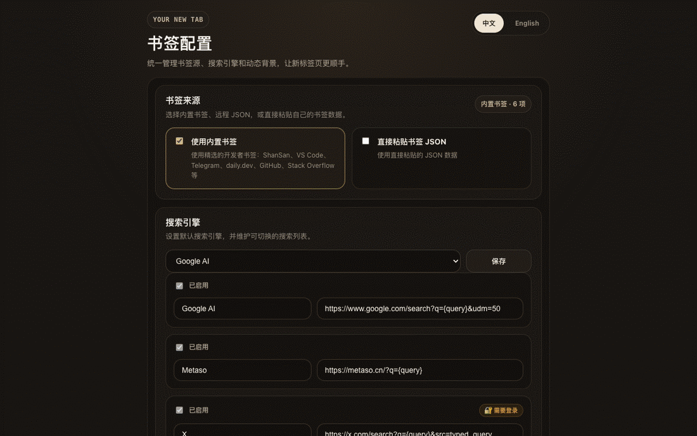

# Your New Tab — AI Search Hub

**Website:** <https://vibe-ideas.github.io/your-new-tab/> · [中文](https://vibe-ideas.github.io/your-new-tab/) / [English](https://vibe-ideas.github.io/your-new-tab/en/)

**AI-search-first new tab.** Open a new tab, type your question once, and send it to Google AI, Metaso, Grok, or X in a single keystroke — or wire in any other search provider in seconds.

## Features

- **AI Search Hub**: Built-in providers for Google AI Mode, Metaso, Grok, and X Search — switch the active provider with one click and it sticks across sessions
- **Bring Your Own Provider**: Add any search/AI URL with a `{query}` template from the popup; icons, ordering, and the default provider are all configurable
- **Smart Search History**: ArrowUp/ArrowDown cycles your last 20 queries, with case-insensitive prefix-match filtering (type `react` then ↑ to walk only past `react…` searches)
- **Live Clock & Date**: Real-time display with elegant typography
- **Personalized Shortcuts**: One-click access to your favorite sites, edited as JSON in the popup
- **Dynamic Backgrounds**: Daily rotation from Unsplash & Picsum
- **Animated Backgrounds**: Optional GIF/APNG/WebP/MP4/WebM URLs, cycled via the windmill button
- **Privacy-First**: All settings live in `localStorage`; no telemetry, no remote code, minimal permissions (no `tabs` API)
- **Adaptive Layout**: Responsive across desktop and laptop screen sizes
- **Smart Fallbacks**: Graceful error handling for every external request

## User Guide

- 中文版: [docs/user-guide.md](docs/user-guide.md)
- English: [docs/user-guide.en.md](docs/user-guide.en.md)

## Changelog

See [CHANGELOG.md](CHANGELOG.md) for detailed information about updates and changes.

## Privacy

See [PRIVACY.md](PRIVACY.md) for the data handling summary used for Chrome Web Store publication.

## Contributing

Contributions are welcome! Please feel free to submit a Pull Request.

1. Fork the repository
2. Create your feature branch (`git checkout -b feature/AmazingFeature`)
3. Commit your changes (`git commit -m 'Add some AmazingFeature'`)
4. Push to the branch (`git push origin feature/AmazingFeature`)
5. Open a Pull Request

## License

This project is licensed under the MIT License - see the [LICENSE](LICENSE) file for details.
