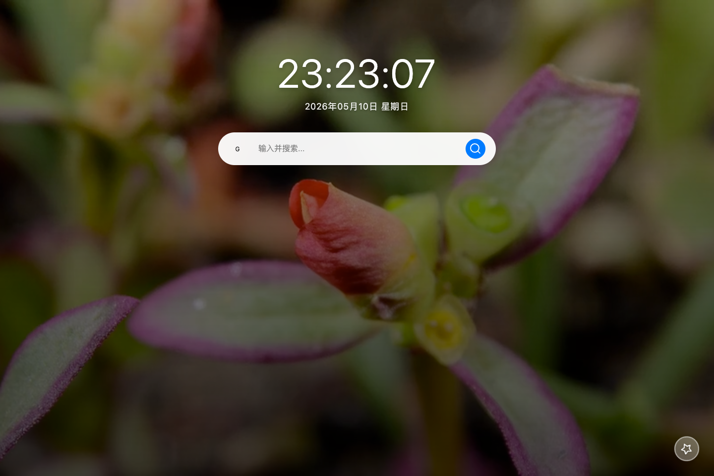

# 用户使用文档

[English version](./user-guide.en.md)

## 动图背景效果

配置完成后，新标签页会把你填写的动图资源作为全屏背景显示：

- `GIF`、`APNG`、`WebP` 会作为动态图片背景展示。
- `MP4`、`WebM`、`MOV` 会作为静音循环视频背景播放。
- 时间、搜索框和快捷方式会继续显示在前景，背景上会叠加一层暗色遮罩保证可读性。
- 右下角风车按钮会按顺序切换你填写的背景 URL。
- 未配置动图背景或资源加载失败时，会自动回退到默认的 Unsplash/Picsum 静态背景。

## 如何使用

1. 打开扩展弹窗。
2. 找到 **动图背景 URL（每行一个）** 输入框。
3. 每行粘贴一个可直接访问的媒体直链。
4. 点击 **保存**。
5. 打开新标签页即可看到新的背景效果。

## 支持格式

- 动图图片：`GIF`、`APNG`、`WebP`
- 动图视频：`MP4`、`WebM`、`MOV`

## URL 要求

- 建议使用文件直链，例如以 `.gif`、`.webm`、`.mp4` 结尾的地址。
- 资源应可匿名访问，不能依赖登录态、临时授权或防盗链校验。
- 如果资源服务端禁止嵌入，扩展会回退到默认静态背景。

## 背景切换

- 点击右下角风车按钮，可切换到下一个已配置的动图背景。
- 扩展会记住当前切换位置。
- 清空输入框并保存，或在弹窗点击 **重置**，即可恢复默认静态背景。

## E2E 测试截图

下面的截图来自 **真实扩展环境** 的 Playwright CLI E2E：先加载打包后的扩展，再在弹窗配置动图背景，打开新标签页并触发一次风车切换，最终验证 MP4 背景已开始播放。



## 复现方式

### 启动开发模式

```bash
pnpm run dev
```

### 复现真实扩展 E2E

在仓库根目录执行以下命令：

```bash
pnpm exec playwright install chromium
pnpm run check
```
