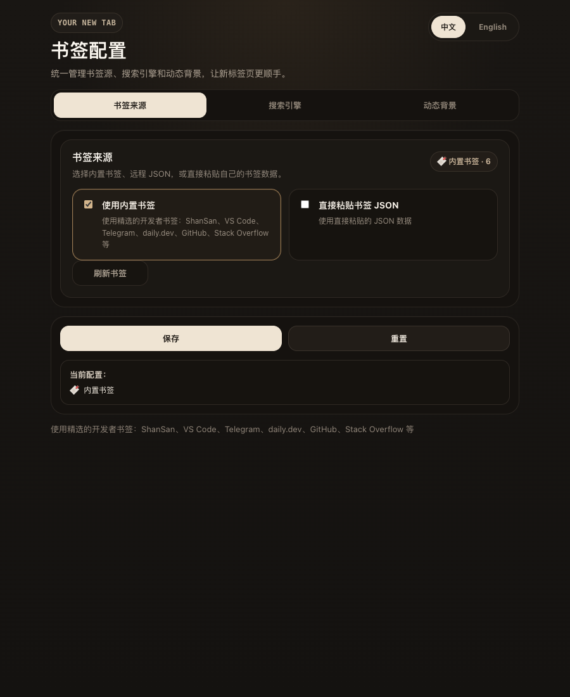
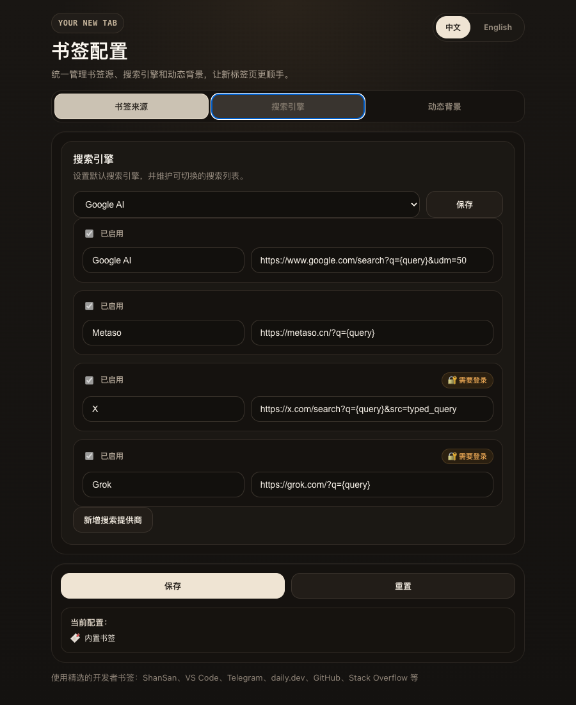
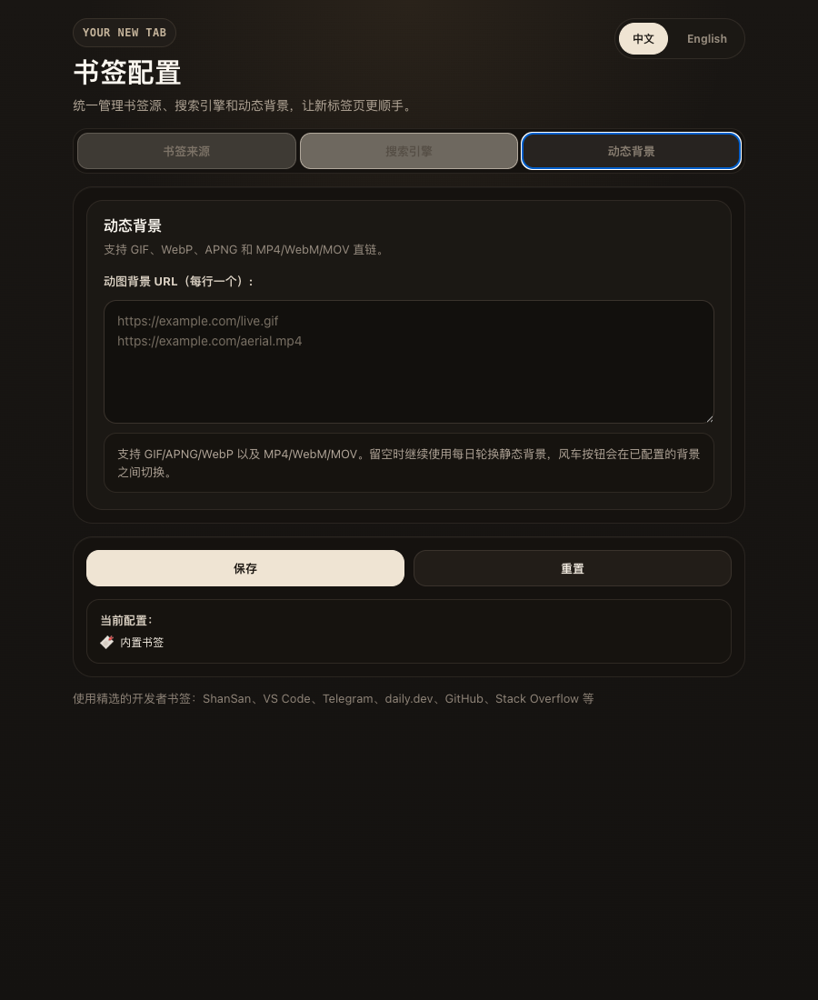

# 用户使用文档

[English version](./user-guide.en.md)

> 本扩展的核心定位是 **AI 搜索优先的新标签页**：打开新标签 → 输入问题 → 一键发送给你选定的 AI/搜索提供商。下面先讲 AI 搜索中心的玩法，再讲背景与书签等周边功能。

## AI 搜索中心

新标签页中央是一个统一的 AI 搜索框，左侧是提供商切换器：

- **内置提供商**：Google AI Mode、Metaso、Grok、X。X 和 Grok 需要先在浏览器里登录其官网。
- **自定义提供商**：在扩展弹窗里点击「添加搜索提供商」，填入名称和 URL 模板（用 `{query}` 占位待填查询）。例如：
  - ChatGPT 搜索：`https://chatgpt.com/?q={query}`
  - Perplexity：`https://www.perplexity.ai/search?q={query}`
  - 任意自家 LLM 网关：`https://your-gateway.example.com/?q={query}`
- **设定默认**：在弹窗的提供商列表中把任意一项标为默认，新标签打开时即自动选中它；最近一次手动切换的结果也会被记住。
- **一键切换**：在新标签页直接点击搜索框左侧的提供商图标即可切换；切换会通过 `storage` 事件同步到其他打开的新标签。
- **隐私**：扩展不会代理你的查询；按下回车后是直接在新窗口打开提供商网站，请求由你的浏览器直接发出。

## 弹窗标签页布局

扩展弹窗采用三标签页布局，避免一次性展示全部配置：

- **书签来源**：选择内置书签或粘贴自定义 JSON。
- **搜索引擎**：维护默认搜索提供商以及可切换的提供商列表。
- **动态背景**：填写动图/视频直链。

底部「保存 / 重置 / 测试 / 刷新书签」操作栏在所有标签页中常驻，无需切换页签即可触发全局操作；切换标签时已编辑的内容会保留在内存中，不会丢失。

| 书签来源标签 | 搜索引擎标签 | 动态背景标签 |
| :---: | :---: | :---: |
|  |  |  |

> 截图由 `node e2e/popup-screenshots.mjs` 在打包后的扩展中生成。

## 书签配置

弹窗 **书签来源** 标签下保留两个入口：

- **使用内置书签**：默认模式，使用扩展内置的开发者常用站点。
- **直接粘贴书签 JSON**：适合导入自己的快捷方式列表，可在弹窗内格式化或压缩 JSON。

书签数据保存在浏览器本机的 `localStorage` 中。重置配置会回到内置书签，不会从外部书签源拉取数据。

### 搜索历史

新标签页的搜索框会自动记录你最近的搜索词，方便用方向键快速复用。

- 按 **Enter** 完成一次搜索后，搜索词会被写入本地历史。
- 在搜索框获得焦点时按 **↑（ArrowUp）** 可向上浏览历史；继续按会逐条切换到更早的记录。
- 按 **↓（ArrowDown）** 反向浏览，到底时会恢复你按方向键之前正在输入的内容。
- 输入框先输入部分文字再按方向键，会按 **前缀匹配**（不区分大小写）过滤，仅在以当前输入开头的历史中切换。
- 历史最多保留 **20 条**，新的搜索会被插入到最前面，超出后自动丢弃最旧的记录。
- 历史保存在 `localStorage` 的 `searchHistory` 键下，仅本机可见；清除浏览器站点数据即可清空。


> 演示流程：先连按 ArrowUp 浏览全量历史，再清空输入并键入 `apple`，按 ArrowUp 仅在以 apple 开头的历史中切换。本动图由 `pnpm run demo:search-history` 生成（基于 Playwright 截帧 + ImageMagick 合成）。

## 动图背景效果

配置完成后，新标签页会把你填写的动图资源作为全屏背景显示：

- `GIF`、`APNG`、`WebP` 会作为动态图片背景展示。
- `MP4`、`WebM`、`MOV` 会作为静音循环视频背景播放。
- 时间、搜索框和快捷方式会继续显示在前景，背景上会叠加一层暗色遮罩保证可读性。
- 右下角风车按钮会按顺序切换你填写的背景媒体直链。
- 未配置动图背景或资源加载失败时，会自动回退到默认的 Unsplash/Picsum 静态背景。

## 如何使用

1. 打开扩展弹窗。
2. 切换到 **动态背景** 标签。
3. 在 **动图背景媒体直链（每行一个）** 输入框里每行粘贴一个可直接访问的媒体直链。
4. 点击底部操作栏的 **保存**。
5. 打开新标签页即可看到新的背景效果。

## 支持格式

- 动图图片：`GIF`、`APNG`、`WebP`
- 动图视频：`MP4`、`WebM`、`MOV`

## 媒体直链要求

- 建议使用文件直链，例如以 `.gif`、`.webm`、`.mp4` 结尾的地址。
- 资源应可匿名访问，不能依赖登录态、临时授权或防盗链校验。
- 如果资源服务端禁止嵌入，扩展会回退到默认静态背景。

## 背景切换

- 点击右下角风车按钮，可切换到下一个已配置的动图背景。
- 扩展会记住当前切换位置。
- 清空输入框并保存，或在弹窗点击 **重置**，即可恢复默认静态背景。

## 动图背景 E2E 测试截图

下面的截图来自 **真实扩展环境** 的 Playwright CLI E2E：先加载打包后的扩展，再在弹窗配置动图背景，打开新标签页并触发一次风车切换，最终验证 MP4 背景已开始播放。


## 复现方式

### 启动开发模式

```bash
pnpm run dev
```

### 复现真实扩展 E2E

在仓库根目录执行以下命令：

```bash
pnpm exec playwright install chromium
pnpm run check
```
